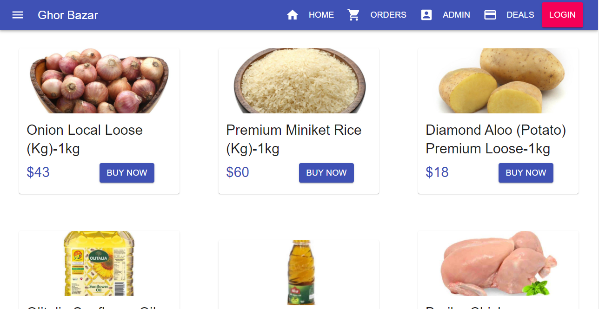
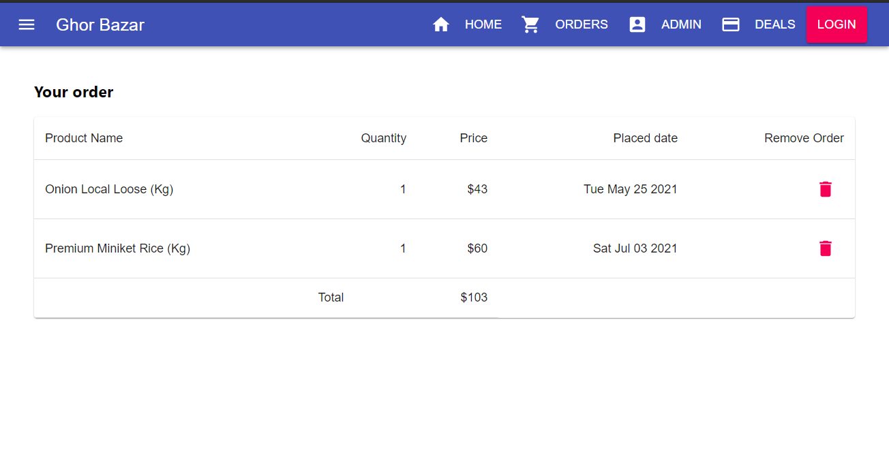
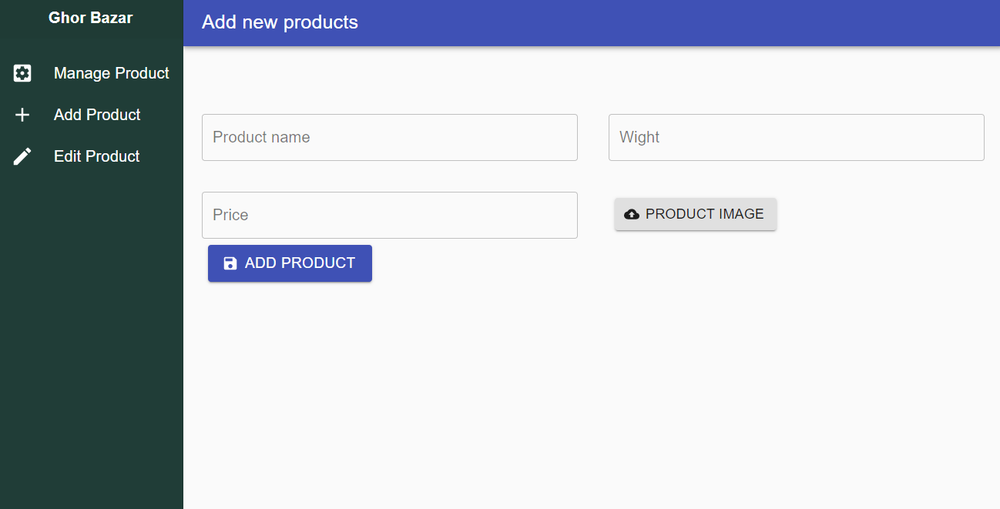

# [Ghor Bazar](https://ghor-bazar.web.app/) | [Client(Github)](https://github.com/AbulBashar38/ghor-bazar-client) | [Server(Github)](https://github.com/AbulBashar38/ghor-bazar-server) 

## Description
#### This website is basically a daily market. All kinds of products are shown on the home page of the website. Clicking on the buy now button of the product you want to buy will ask the buyer to log in and then take you to the check out page. There will be a description of the product then click on the check out button to confirm the order and take you to the next page. There you will see a list of what products the buyer has ordered. You can cancel the order from there. In the admin panel, you can delete products from Manage Products, add new products from Ad Products.

## Features
* All product Show in Home page
* Firebase Google Authentication for every page
* Before order can go in the check out page
* user can see orders and can cancel order.
* Admin can delete and add product from admin panel.
* Data loading spinner

## Technology:
* html5
* css3
* react js
* Material ui
* react-router
## Photos
#### This is home page

#### This is Order page

#### This is Admin page

#### This is add product page

###### Live link of the web side : https://ghor-bazar.web.app/
###### Server link of the web side : https://github.com/AbulBashar38/ghor-bazar-client
